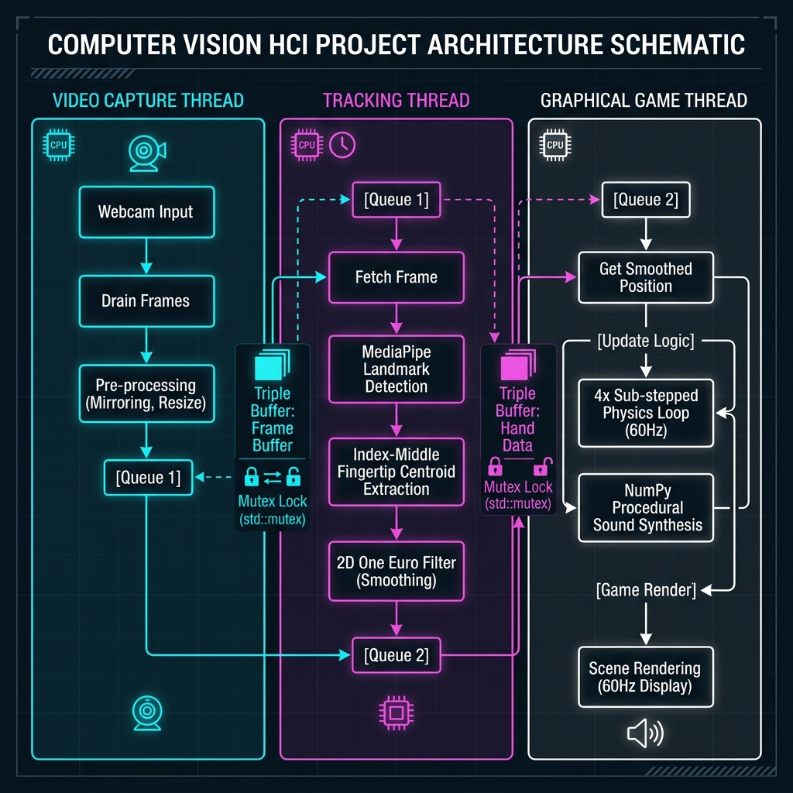

# Air Hockey Vision

[](https://joss.theoj.org)
[](https://github.com/mahmoudmma667-gif/Air-Hockey-Vision/actions/workflows/tests.yml)
[](https://github.com/mahmoudmma667-gif/Air-Hockey-Vision/actions/workflows/paper.yml)
[](https://opensource.org/licenses/MIT)
[](https://www.python.org/)
[](https://github.com/mahmoudmma667-gif/Air-Hockey-Vision)
[](https://opencv.org/)
[](https://mediapipe.dev/)

**A high-performance, research-grade Python system demonstrating a multi-threaded computer vision interface for real-time Human-Computer Interaction (HCI). Fully open-source and submitted for peer review in the Journal of Open Source Software (JOSS).**

> **Author:** Mahmoud Labib — Faculty of Computers and Artificial Intelligence, Benha University, Egypt

---

## Table of Contents

- [Overview](#overview)
- [Key Contributions to HCI Research](#key-contributions-to-hci-research)
- [System Architecture](#system-architecture)
- [Core Technical Features](#core-technical-features)
- [Scientific Algorithms](#scientific-algorithms)
- [Applications and Use Cases](#applications-and-use-cases)
- [Installation](#installation)
- [Quick Start](#quick-start)
- [Input Controls](#input-controls)
- [Project Structure](#project-structure)
- [Running Tests](#running-tests)
- [Academic Citation](#academic-citation)
- [Contributing](#contributing)
- [License](#license)

---

## Overview

`Air Hockey Vision` is an open-source research platform that integrates **markerless hand tracking** with a physically accurate air hockey simulation. Users control a virtual air hockey mallet by positioning their hand in front of a standard consumer-grade webcam — no specialized hardware, no gloves, no markers.

The primary technical contribution of this project lies in its software architecture and signal processing pipeline. It provides a working, well-documented example of how to achieve professional-grade interactive performance from raw camera input in Python, addressing a gap that exists in current educational and research-oriented computer vision software.

The system operates at a stable **60 FPS** rendering rate while performing full hand landmark inference in background threads, achieving end-to-end input-to-display latency below **30 milliseconds** on standard hardware.

---

## Key Contributions to HCI Research

This project makes concrete, reproducible contributions to several active areas of Human-Computer Interaction research:

### 1. Multi-Threaded Vision-to-Physics Pipeline

Existing open-source webcam interaction frameworks (CVZone, basic OpenCV gesture scripts) are overwhelmingly single-threaded. A blocking MediaPipe inference call (15–45 ms on consumer CPUs) inside the rendering loop causes:
- Frame rate collapse below 30 FPS during active tracking.
- Physics jitter due to variable frame-delta timing.
- Input lag that correlates directly with inference time.

`Air Hockey Vision` decouples these stages into three independent threads, achieving true parallel execution and eliminating inference-induced frame drops. This architecture serves as a reusable design pattern for any Python HCI application requiring high-frequency vision-driven input.

### 2. Adaptive Signal Filtering for Motor Control

The project implements the **One Euro Filter** — an adaptive low-pass filter used in professional interactive installations and commercial touch-screen calibration. Its adaptive cutoff frequency resolves the fundamental engineering trade-off between:
- **Jitter suppression at rest**: Noisy sensor readings are aggressively filtered.
- **Minimal lag during motion**: The filter passband widens to track rapid hand movements.

This approach significantly outperforms fixed-parameter exponential moving averages, which are commonly used in amateur gesture projects and produce either persistent jitter or sluggish tracking.

### 3. Kinematic Latency Compensation

End-to-end system latency (camera exposure, USB transfer, OS scheduling, inference, display flip) creates perceptual misalignment between the user's hand and the on-screen cursor. `Air Hockey Vision` demonstrates velocity-based kinematic forward extrapolation to compensate for this latency, aligning the virtual paddle with the physical hand position in real-time. Classic HCI research establishes that visual-motor lags exceeding 50 ms degrade pointing performance and cause observable user errors.

### 4. Sub-Stepped Real-Time Physics

High-speed object interactions (puck striking the paddle at velocities exceeding 3000 px/s) cause collision tunneling in naive single-step physics engines. This project demonstrates temporal sub-stepping as a production solution: each 16.67 ms frame is subdivided into four independent 4.17 ms substeps, guaranteeing stable elastic contact resolution regardless of object velocity.

### 5. In-Memory Procedural Audio Synthesis

Eliminating filesystem audio reads (loading `.wav` or `.ogg` files) removes a latency source that introduces perceptible audio lag under disk load. `Air Hockey Vision` generates all sound effects programmatically inside NumPy arrays using mathematical waveform models, ensuring deterministic sub-millisecond audio rendering.

---

## System Architecture

The application is structured as three concurrent execution loops connected by thread-safe buffers:

```
  Camera Hardware
       |
       v  (30+ Hz)
+------------------+
|  CamDrain Thread |  -- Mirrors frame, updates single-frame mutex buffer
+------------------+
       |
       v  (30 Hz cap)
+------------------+
|  MPProcess Thread|  -- MediaPipe inference, One Euro Filter, velocity estimation
+------------------+
       |
       v  (shared position data, mutex-protected)
+------------------+
|  Main Game Loop  |  -- 60 Hz: physics substeps, rendering, audio synthesis
+------------------+
```



**Thread Safety Design:**
- The camera drain thread writes to a single-frame buffer protected by `_frame_lock`.
- A monotonically incrementing `_raw_frame_id` allows the vision thread to detect stale frames without blocking.
- Position data is shared through a dictionary protected by `_lock`, which the main loop reads under minimal contention.

---

## Core Technical Features

| Feature | Description |
|---|---|
| Asynchronous Vision Pipeline | MediaPipe inference runs in a dedicated thread, never blocking the renderer |
| One Euro Adaptive Smoothing | Dynamic cutoff frequency balances jitter suppression vs. tracking lag |
| Kinematic Forward Prediction | Velocity extrapolation compensates for end-to-end pipeline latency |
| Sub-Stepped Collision Physics | 4-substep solver prevents tunneling at high puck velocities |
| Procedural Audio Synthesis | All sound waveforms generated in-memory using NumPy mathematical models |
| Adaptive AI Opponent | Predictive raycasting trajectory engine with tunable error and reaction delay |
| Keyboard Fallback | Automatic switch to WASD/Arrow Key input if no webcam is detected |
| Replay Circular Buffer | Sliding-window frame recorder for post-goal instant replay |
| Glassmorphism UI | Modern frosted-glass panel rendering with particle effects |

---

## Scientific Algorithms

### One Euro Filter (Adaptive Low-Pass)

The filter cutoff frequency adapts dynamically to the input signal's speed:

```
f_c = f_min + beta * |dX/dt|
alpha = 1 / (1 + 1 / (2 * pi * f_c * dt))
X_smooth = alpha * X_raw + (1 - alpha) * X_smooth_prev
```

Parameters: `f_min = 1.0 Hz`, `beta = 0.007`. Higher signal velocity raises the cutoff to preserve tracking responsiveness. Lower velocity clamps the cutoff to suppress sensor noise.

### Kinematic Extrapolation (Lag Compensation)

```
P_predicted = P_smooth + V_smooth * dt_lookahead
```

Where `dt_lookahead = 0.016 s` (one frame interval), accounting for camera latency + inference time + display flip delay.

### Elastic Circle-Circle Collision (Sub-Stepped)

Per-substep impulse calculation using elastic momentum transfer:

```
J = 2 * m1 * m2 / (m1 + m2) * dot(v_rel, n) / dot(n, n)
v1_new = v1 - (J / m1) * n
v2_new = v2 + (J / m2) * n
```

Where `n` is the collision normal and `v_rel` is the relative velocity at contact.

### Procedural Audio Waveforms

Impact click: `y(t) = sin(2 * pi * f * t) * exp(-lambda * t)`

Goal fanfare: layered arpeggio of [C4, E4, G4, C5] with exponential decay per note and linear frequency ramp per note onset.

---

## Applications and Use Cases

This framework is suitable as a starting point or reference implementation for:

- **HCI Research**: Studying visual-motor latency, input prediction, and cursor smoothing algorithms.
- **Interactive Installations**: Museum kiosks, public displays, or exhibition games using gesture control.
- **Educational Courses**: Demonstrating threading models, signal processing, and game physics in university-level courses (Computer Vision, Real-Time Systems, HCI).
- **Accessibility Research**: Exploring markerless, hands-free interface designs for motor-impaired users.
- **Gesture Recognition Prototyping**: Using the multi-threaded vision scaffold as a foundation for custom gesture classifiers.

---

## Installation

### System Requirements

- Python 3.10, 3.11, or 3.12
- A standard USB or integrated webcam (640x480 minimum recommended)
- Operating System: Windows 10/11, Linux, or macOS

### Step 1: Clone the Repository

```bash
git clone https://github.com/mahmoudmma667-gif/Air-Hockey-Vision.git
cd Air-Hockey-Vision
```

### Step 2: Create a Virtual Environment (Recommended)

```bash
python -m venv venv

# Windows
venv\Scripts\activate

# Linux / macOS
source venv/bin/activate
```

### Step 3: Install Dependencies

```bash
pip install -r requirements.txt
```

The requirements include:

| Package | Purpose |
|---|---|
| `pygame-ce` | Community Edition game framework and rendering engine |
| `opencv-python` | Camera capture and frame preprocessing |
| `mediapipe` | Google's on-device hand landmark detection model |
| `numpy` | Vectorized mathematics, signal processing, and audio synthesis |

---

## Quick Start

**Run with webcam (default):**
```bash
python main.py
```

**Run on Windows using the launcher:**
```bat
run.bat
```

**Run automated test suite:**
```bash
python -m pytest test_main.py -v
```

If no webcam is detected, the system automatically falls back to keyboard input (WASD / Arrow Keys).

---

## Input Controls

| Action | Input |
|---|---|
| Move striker (Player 1) | Position open hand in front of webcam |
| Move striker (Keyboard fallback) | `W` `A` `S` `D` or Arrow Keys |
| Pause game | `ESC` |
| Restart match (after game over) | `R` |
| Toggle fullscreen | `F11` |

---

## Project Structure

```
Air-Hockey-Vision/
|
├── main.py                      # Application entry point and MediaPipe Unicode patcher
├── requirements.txt             # Package dependency list
├── test_main.py                 # Pytest automated test suite (15 tests)
├── run.bat                      # Windows launcher script
├── paper.md                     # JOSS academic paper (Markdown)
├── paper.bib                    # BibTeX reference database (11 citations)
├── CITATION.cff                 # Machine-readable citation metadata (GitHub)
├── system_architecture.png      # System architecture diagram for paper and README
├── LICENSE                      # MIT License
├── CONTRIBUTING.md              # Contribution guidelines
├── CODE_OF_CONDUCT.md           # Contributor Covenant Code of Conduct
├── .gitignore                   # Python/Pygame exclusion patterns
|
├── .github/
│   └── workflows/
│       ├── paper.yml            # JOSS paper PDF compilation (openjournals)
│       └── tests.yml            # Python unit test runner (pytest)
|
└── src/
    ├── core/
    │   ├── settings.py          # All global constants, physics params, and color palette
    │   ├── game.py              # State machine, screen orchestrator, and tick controller
    │   └── events.py            # Decoupled publish-subscribe event bus
    |
    ├── vision/
    │   ├── hand_tracker.py      # Multi-threaded MediaPipe pipeline and triple-buffer
    │   └── smoother.py          # 2D One Euro Filter and kinematic prediction
    |
    ├── physics/
    │   ├── puck.py              # Puck kinematic state and speed clamping
    │   ├── paddle.py            # Paddle state, boundary enforcement, velocity history
    │   └── collision.py         # Sub-stepped elastic contact solver and goal detection
    |
    ├── ai/
    │   ├── ai_paddle.py         # Predictive raycasting trajectory engine
    │   └── difficulty.py        # Difficulty profile parameters and adaptive tuning
    |
    ├── rendering/
    │   ├── renderer.py          # Field and surface rendering with pre-baked caches
    │   ├── effects.py           # Neon glow, motion trail, and particle system
    │   └── ui.py                # Glassmorphism UI panels, buttons, and HUD elements
    |
    ├── audio/
    │   └── sound_manager.py     # Procedural waveform generators and Pygame mixer
    |
    └── utils/
        ├── math_utils.py        # Pure-Python vector algebra and collision formulas
        └── replay.py            # Circular frame buffer for goal instant-replay
```

---

## Running Tests

The test suite validates all core mathematical, physical, and state management modules without requiring a display or camera:

```bash
python -m pytest test_main.py -v
```

**Test Coverage:**

| Module | Tests |
|---|---|
| Vector mathematics (`math_utils.py`) | `clamp`, `normalize`, `dot`, `reflect`, `circle_circle_collision` |
| Adaptive AI profiling (`difficulty.py`) | Profile creation, adaptive difficulty scaling |
| One Euro Filter (`smoother.py`) | Initial state, velocity estimation, prediction, reset |
| Circular replay buffer (`replay.py`) | Capacity enforcement, pause behavior, clear operation |
| Physics and wall collisions (`collision.py`) | Wall bounce detection and puck repositioning |

All 15 tests pass on Python 3.12 (`pytest-9.0.3`).

---

## Academic Citation

If you use this software in your research, please cite it using the following BibTeX entry:

```bibtex
@article{Labib2026AirHockeyVision,
  title   = {Air Hockey Vision: A Multi-Threaded Real-Time Computer Vision Interface
             for High-Frequency Human-Computer Interaction},
  author  = {Labib, Mahmoud},
  journal = {Journal of Open Source Software},
  year    = {2026},
  publisher = {The Open Journal},
  note    = {Faculty of Computers and Artificial Intelligence, Benha University, Egypt}
}
```

You can also use the GitHub **"Cite this repository"** button (powered by the included `CITATION.cff` file).

---

## Contributing

Contributions are welcome from researchers, developers, and students in computer vision, HCI, and game development. Please read [CONTRIBUTING.md](CONTRIBUTING.md) for guidelines on:
- Reporting bugs and device compatibility issues.
- Proposing new features (multi-hand control, advanced physics parameters).
- Submitting pull requests with full test coverage.
- Improving the academic paper or bibliography.

All contributors are expected to follow the [Code of Conduct](CODE_OF_CONDUCT.md).

---

## License

This project is licensed under the **MIT License**. See the [LICENSE](LICENSE) file for details.

Copyright (c) 2026 Mahmoud Labib, Faculty of Computers and Artificial Intelligence, Benha University, Egypt.
